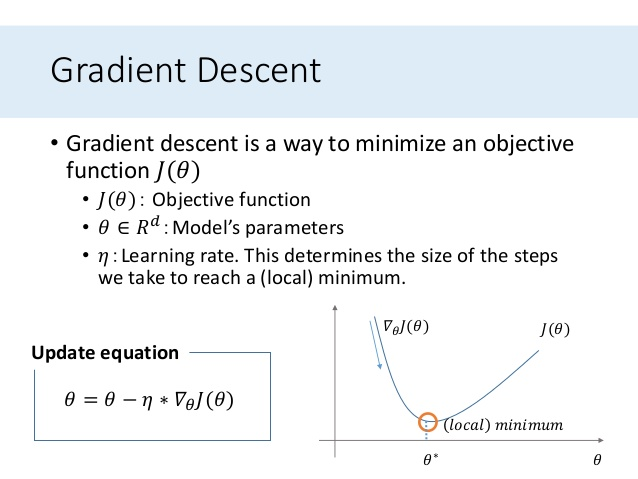
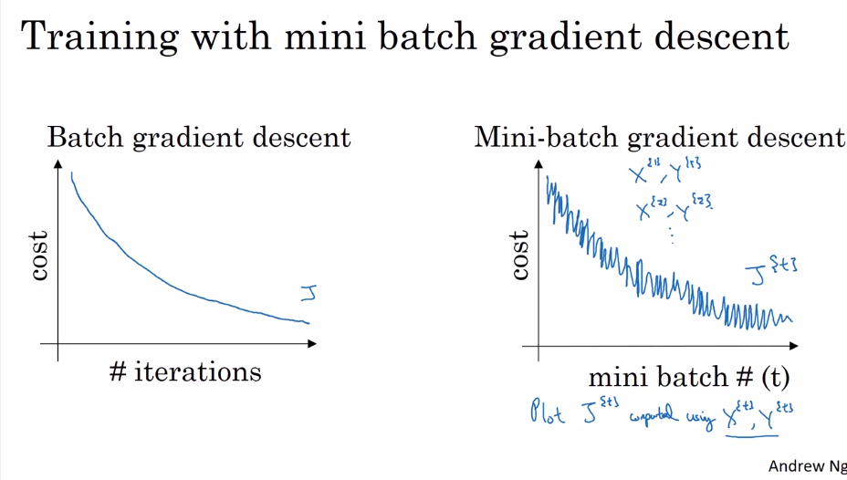
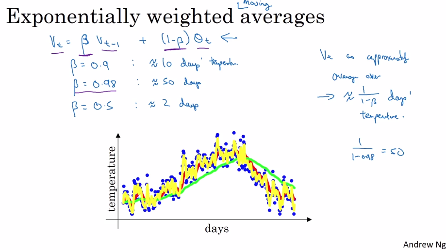
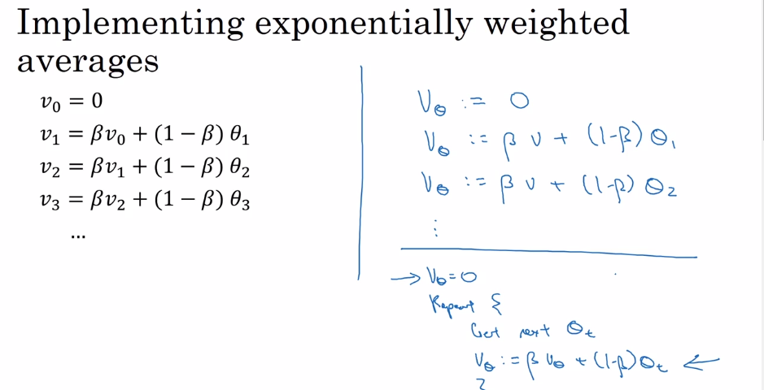
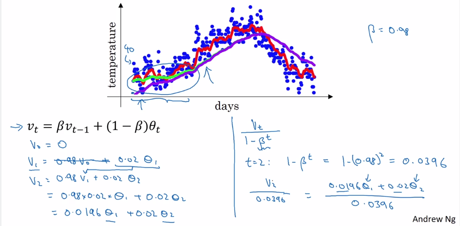
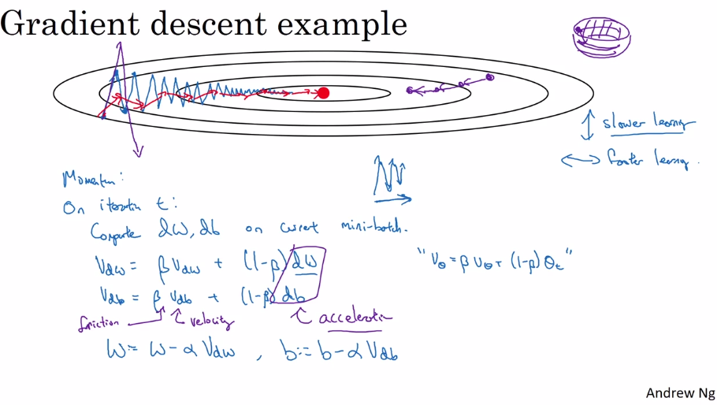
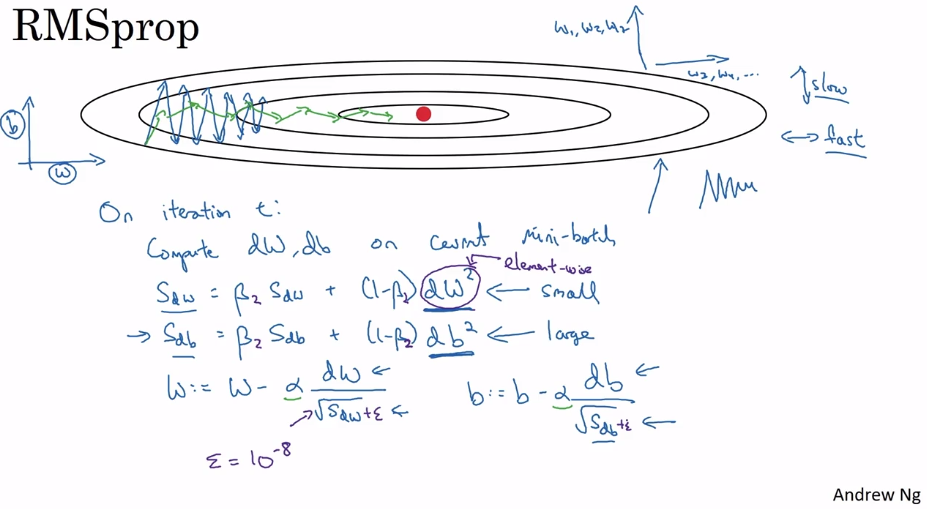

# Gradient Descent Algorithm
Reference: https://machinelearningmastery.com/gentle-introduction-mini-batch-gradient-descent-configure-batch-size/

The three main flavors of gradient descent are batch, stochastic, and mini-batch.

## Stochastic Gradient Descent

Stochastic gradient descent, often abbreviated SGD, is a variation of the gradient descent algorithm that calculates the error and updates the model for each example in the training dataset.

The update of the model for each training example means that stochastic gradient descent is often called an online machine learning algorithm.

**Upsides**
- The frequent updates immediately give an insight into the performance of the model and the rate of improvement.
- This variant of gradient descent may be the simplest to understand and implement, especially for beginners.
- The increased model update frequency can result in faster learning on some problems.
- The noisy update process can allow the model to avoid local minima (e.g. premature convergence).

**Downsides**
- Updating the model so frequently is more computationally expensive than other configurations of gradient descent, taking significantly longer to train models on large datasets.
- The frequent updates can result in a noisy gradient signal, which may cause the model parameters and in turn the model error to jump around (have a higher variance over training epochs).
- The noisy learning process down the error gradient can also make it hard for the algorithm to settle on an error minimum for the model.

## Batch Gradient Descent
Batch gradient descent is a variation of the gradient descent algorithm that calculates the error for each example in the training dataset, but only updates the model after all training examples have been evaluated.

One cycle through the entire training dataset is called a training epoch. Therefore, it is often said that batch gradient descent performs model updates at the end of each training epoch.

**Upsides**
- Fewer updates to the model means this variant of gradient descent is more computationally efficient than stochastic gradient descent.
- The decreased update frequency results in a more stable error gradient and may result in a more stable convergence on some problems.
- The separation of the calculation of prediction errors and the model update lends the algorithm to parallel processing based implementations.

**Downsides**
- The more stable error gradient may result in premature convergence of the model to a less optimal set of parameters.
- The updates at the end of the training epoch require the additional complexity of accumulating prediction errors across all training examples.
- Commonly, batch gradient descent is implemented in such a way that it requires the entire training dataset in memory and available to the algorithm.
- Model updates, and in turn training speed, may become very slow for large datasets.

## Mini-Batch Gradient Descent
Mini-batch gradient descent is a variation of the gradient descent algorithm that splits the training dataset into small batches that are used to calculate model error and update model coefficients.

Implementations may choose to sum the gradient over the mini-batch or take the average of the gradient which further reduces the variance of the gradient.

Mini-batch gradient descent seeks to find a balance between the robustness of stochastic gradient descent and the efficiency of batch gradient descent. It is the most common implementation of gradient descent used in the field of deep learning.

**Upsides**
- The model update frequency is higher than batch gradient descent which allows for a more robust convergence, avoiding local minima.
- The batched updates provide a computationally more efficient process than stochastic gradient descent.
- The batching allows both the efficiency of not having all training data in memory and algorithm implementations.

**Downsides**

- Mini-batch requires the configuration of an additional “mini-batch size” hyperparameter for the learning algorithm.
- Error information must be accumulated across mini-batches of training examples like batch gradient descent.

# Gradient Descent Images

