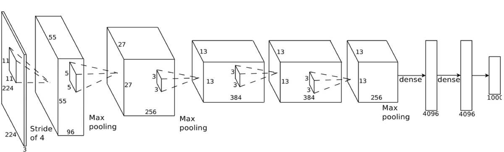

Table of Contents
=================
   * [Plain Vanilla Neural Networks (NN) and Convolutional Neural Networks (CNNs)](#plain-vanilla-neural-networks-nn-and-convolutional-neural-networks-cnns)
   * [Week1: Convolutional Neural Nets (CNN or ConvNets)](#week1-convolutional-neural-nets-cnn-or-convnets)
   * [Week2: Residual Networks (ResNets)](#week2-residual-networks-resnets)

# Plain Vanilla Neural Networks (NN) and Convolutional Neural Networks (CNNs)

# Week1: Convolutional Neural Nets (CNN or ConvNets)
- Vanilla Neural Network: https://medium.com/@curiousily/tensorflow-for-hackers-part-iv-neural-network-from-scratch-1a4f504dfa8
- Vanilla Neural Network for MNIST: https://www.easy-tensorflow.com/tf-tutorials/neural-networks/two-layer-neural-network
- Convolution gifs: https://leonardoaraujosantos.gitbooks.io/artificial-inteligence/content/convolutional_neural_networks.html
- Explanations: https://www.analyticsvidhya.com/blog/2017/06/architecture-of-convolutional-neural-networks-simplified-demystified/
- Different CNN architectures://www.jeremyjordan.me/convnet-architectures/

- Classic network architectures
  + [LeNet-5](https://ethereon.github.io/netscope/#/gist/5166ee1d07cd3521cdfbe8aa8ffc5693)
  + [AlexNet](https://dgschwend.github.io/netscope/#/preset/alexnet)
  + [VGG 16](https://dgschwend.github.io/netscope/#/preset/vgg-16)
  + [FCN-16](https://dgschwend.github.io/netscope/#/preset/fcn-16s)
- Modern network architectures
  + [Inception v3](https://dgschwend.github.io/netscope/#/preset/inceptionv3), [Inception v4](https://dgschwend.github.io/netscope/#/preset/inceptionv4), [Inception-ResNet-v2](https://dgschwend.github.io/netscope/#/preset/inceptionv4_resnet)
  + [ResNet-50](https://dgschwend.github.io/netscope/#/preset/resnet-50), [ResNet-152](https://dgschwend.github.io/netscope/#/preset/resnet-50), [SE-ResNeXt-50](http://ethereon.github.io/netscope/#/gist/5c91ed8333d88877c077afabe1b1df42)
  + [CaffeNet](https://dgschwend.github.io/netscope/#/preset/caffenet)
  + [YOLO](https://dgschwend.github.io/netscope/#/preset/YOLO)
  + [SqueezeNet](https://dgschwend.github.io/netscope/#/preset/squeezenet), [SqueezeNet 1.1](https://dgschwend.github.io/netscope/#/preset/squeezenet_v11)
  + [GoogLeNet](https://dgschwend.github.io/netscope/#/preset/googlenet)

# Week2: Residual Networks (ResNets)
- Interactive CNN architectures by [Netscope](https://dgschwend.github.io/netscope/quickstart.html)
- ResNet : http://ethereon.github.io/netscope/#/gist/db945b393d40bfa26006
- GoogleNet: https://ethereon.github.io/netscope/#/preset/googlenet 

