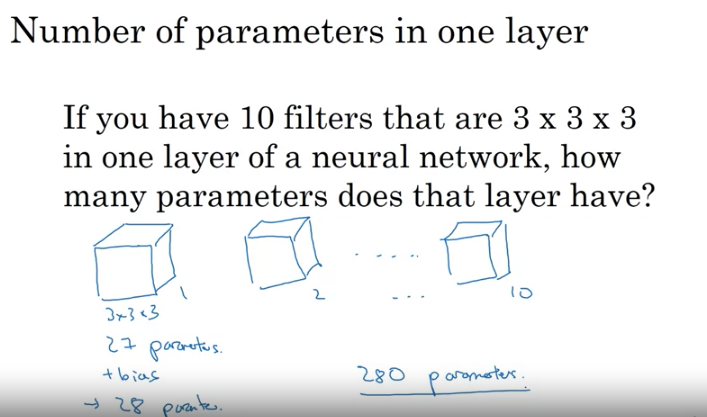
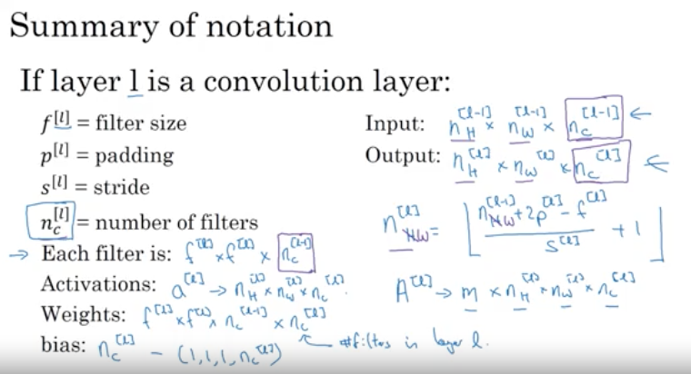
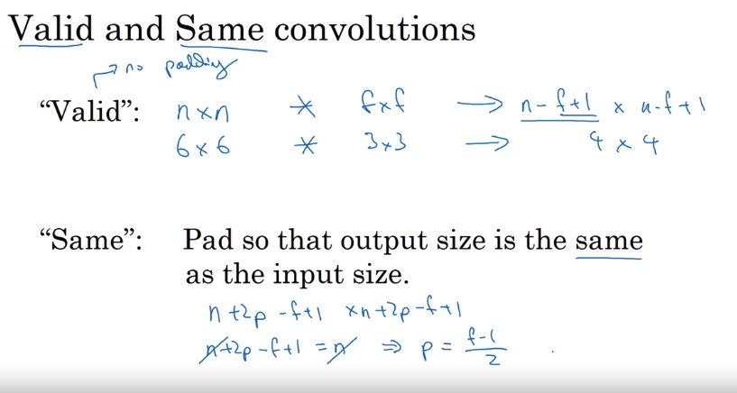
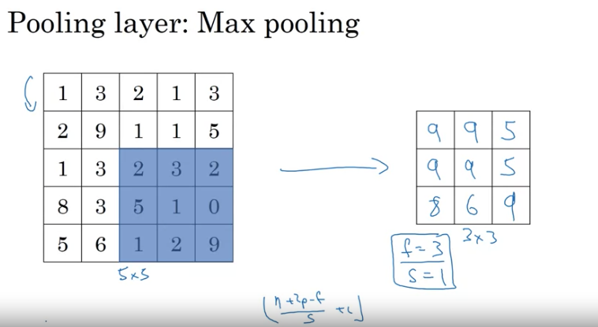
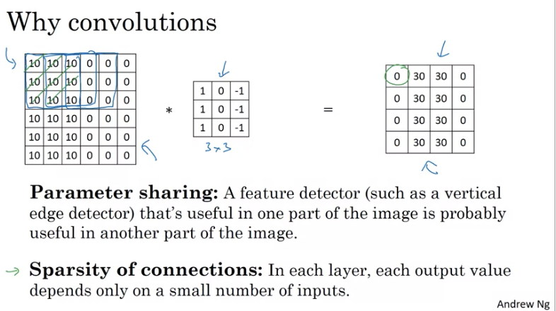

# Week 1 quiz - The basics of ConvNets


1. What do you think applying this filter to a grayscale image will do?
```
0 1 -1 0
1 3 -3 -1
1 3 -3 -1
0 1 -1 0
```

	- Detect horizontal edges

	- > Detect vertical edges

	- Detect 45 degree edges

	- Detect image contrast

2. Suppose your input is a 300 by 300 color (RGB) image, and you are not using a convolutional network. If the first hidden layer has 100 neurons, each one fully connected to the input, how many parameters does this hidden layer have (including the bias parameters)?

```
We have just one image of cat with length=300 height=300 pixels. There are 3 channels RGB. So one input image has 
300*300*3 = 270,000 numbers to represent it.
Each point is connected to the hidden layer. Hidden layer has 100 neurons. Each points are connected to each neurons.
270,000 * 100 = 27,000,000 fully connected layers.
For 100 neurons in hidden layers there are 100 bias connections.
So total = 27,000,000 + 100 = 27,000,100

Note: For 100 Neurons ==> 100 bias terms added in the end.
      Do not multiply 1 extra bias to input elements 270,000. 100 neurons means 100 bias terms. Period.
```

	- 9,000,001

	- 9,000,100

	- 27,000,001

	- > 27,000,100

3. Suppose your input is a 300 by 300 color (RGB) image, and you use a convolutional layer with 100 filters that are each 5x5. How many parameters does this hidden layer have (including the bias parameters)?

```
We are calculating total number of parameters of Hidden Layer1.
Hidden layer 1 has 100 filters.
Each filter has size 5*5*3, so it has 75 points. We also need one bias point for each filter. 
So total parameters for only one filter is 76.
We have 100 such filters.
Therefore, total number of paramters in hidden layer 1 = 76*100 = 7600
```

	- 2501

	- 2600

	- 7500

	- > 7600

4. You have an input volume that is 63x63x16, and convolve it with 32 filters that are each 7x7, using a stride of 2 and no padding. What is the output volume?

```
input                           filter                             output
63*63*16                        7*7*16                             n_H[l] * n_W[l] * n_c[l]
n_H[l-1] = n_W[l-1] = 63        f[l] = 7 or just f = 7             where,
n_c[l-1] = 16                   number of filters n_c[l] = 32      n_H[l] = floor (   (n_H[l-1] + 2p[l] - f[l])/s[l] + 1   )                                                                           = (63+2*0-7)/2 + 1 = 29
To find output number in n_H[l], it depends on four things:
- Previous n_H[l-1]  (only n_H is previous, all other are current)
- current padding   2*p[l]  2 because we pad both top and bottom of each 2d image.
- current filter size f[l]
- current striding  s[l]
```

        - 16x16x32

	- 29x29x16

	- > 29x29x32

	- 16x16x16

5. You have an input volume that is 15x15x8, and pad it using “pad=2.” What is the dimension of the resulting volume (after padding)?
```
We have 8 sheets of 2d image of shape 15*15.
After padding top and bottom the shape of 2d image becomes 19*19.
We have 8 of these 2d images.
So, result is 19*19*8.
```

	- 19x19x12

	- 17x17x10

	- > 19x19x8

	- 17x17x8

6. You have an input volume that is 63x63x16, and convolve it with 32 filters that are each 7x7, and stride of 1. You want to use a “same” convolution. What is the padding?

```
For SAME padding:
n +2p -f + 1 = n
p = (f-1)/2 = (7-1)/2 = 3
```

	- 1

	- 2

	- > 3

	- 7

7. You have an input volume that is 32x32x16, and apply max pooling with a stride of 2 and a filter size of 2. What is the output volume?

```
There are 16 2d images of size 32*32 in input.
After MAX pooling, we get smaller size of each 2d image determined by pooling layer size.
After pooling 2d image shrinks to size =  (n+2p-f+1)/s + 1
 = (32 + 2*0 - 2 ) / 2 + 1 = 16
 
We have 16 of these 2d images.
So, answer = 16*16*16
```

	- 15x15x16

	- > 16x16x16

	- 32x32x8

	- 16x16x8

8. Because pooling layers do not have parameters, they do not affect the backpropagation (derivatives) calculation.

	- True

	- > False

9. In lecture we talked about “parameter sharing” as a benefit of using convolutional networks. Which of the following statements about parameter sharing in ConvNets are true? (Check all that apply.)


	- It allows parameters learned for one task to be shared even for a different task (transfer learning).

	- > It reduces the total number of parameters, thus reducing overfitting.
	    (Remember this: Parameter sharing also reduces overfitting.)

	- It allows gradient descent to set many of the parameters to zero, thus making the connections sparse.
	  (This is true but not related to parameter sharing.)

	- > It allows a feature detector to be used in multiple locations throughout the whole input image/input volume.
	    (This is discussed in lecture.)

10. In lecture we talked about “sparsity of connections” as a benefit of using convolutional layers. What does this mean?

	- Each filter is connected to every channel in the previous layer.

	- > Each activation in the next layer depends on only a small number of activations from the previous layer.

	- Each layer in a convolutional network is connected only to two other layers

	- Regularization causes gradient descent to set many of the parameters to zero.
